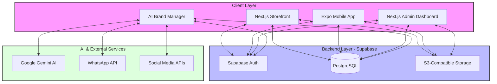

# System Architecture

The Goniaa ecosystem follows a modern, decoupled architecture centered around a unified Supabase backend.

## Data Flow Highlights
1.  **Authentication:** Centralized via Supabase Auth across all platforms.
2.  **Product Updates:** Admin Dashboard modifies PostgreSQL, which triggers real-time updates in the Storefront and Mobile App.
3.  **AI Workflow:** The Brand Manager fetches data from DB, processes it via Gemini AI for content generation, and schedules it back to the Content Calendar.
4.  **Asset Management:** All media (product images, banners, content) is routed through a standardized Image Service to Supabase Storage.
